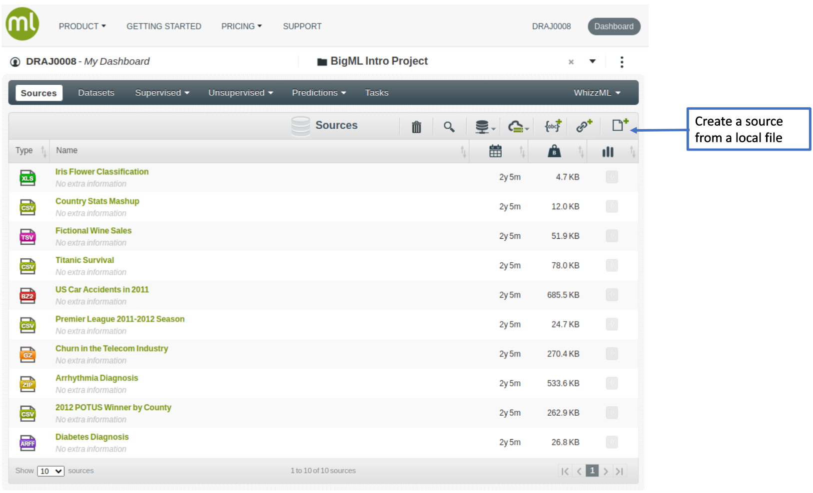
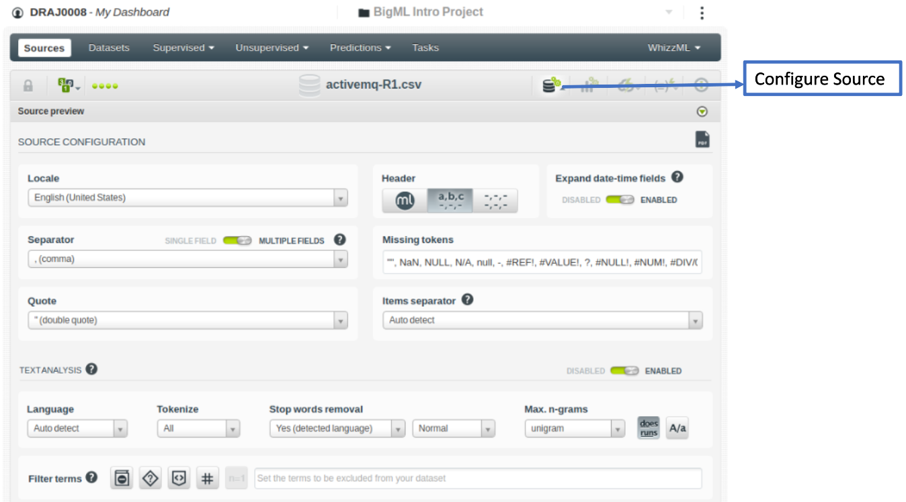
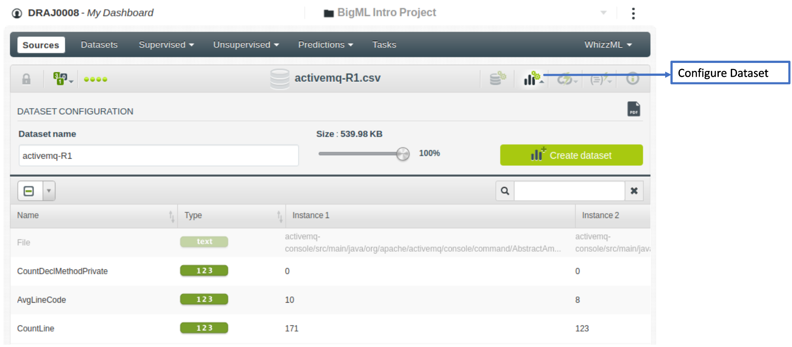
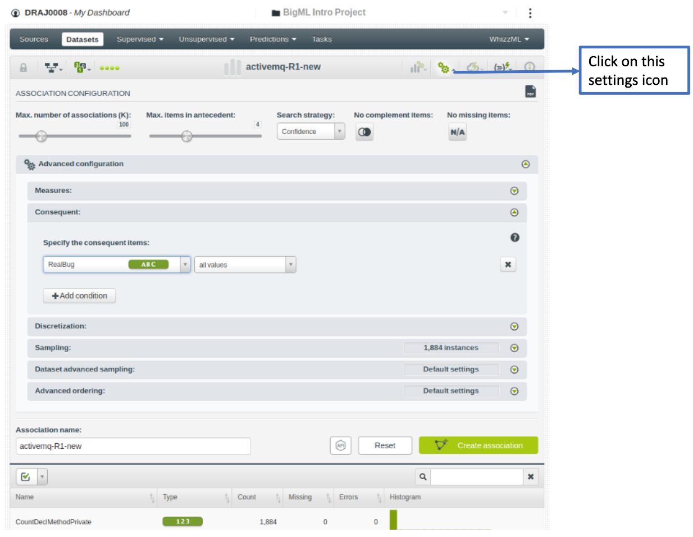

```{r setup, include=FALSE}
knitr::opts_chunk$set(echo = TRUE)
```

# Generating rule-based Explanations
The execution steps of our framework is explained below.

1. Build global models
2. Generate the neighbourhood using instance_generation function in defect_class.py
3. Generate the rules using Association Rule Mining. 
   Here, the generated neighbourhood of a particular instance is considered as the input the association rule miner. 
      * Option 1: The most closest open source package to Magnum Opus is, Opus Miner <https://cran.r-project.org/web/packages/opusminer/index.html>
      * Option 2: Use BigML <https://bigml.com/dashboard/sources>
      
  **The steps of generating rules using BigML** 
  
  Step 1: Click on the dataset with the neighbourhood in the source file
  
      
  Step 2: Click on configure dataset
    
  
  
 Step 3: Click on configure dataset. After deselecting unwanted fields, click on “Create Dataset”
  
    
  Step 4: Click on Association under un-supervised category to build the model. Set the search category (confidence, coverage, lift and leverage). Specify the consequent as the target column.  
  
  
  
  Step 5: Click on "Association" under unsupervised category to generate the model 
    
  
  
  Step 6: Output rules and import those rules to csv.
   
  
4. Categorize generated rules to four different types; which provide four types of guidance using excel_defect.py 


