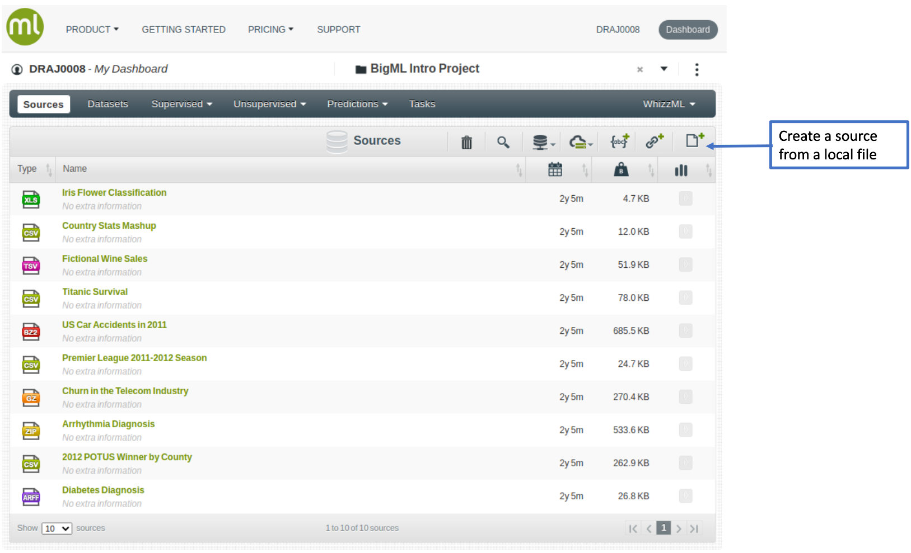
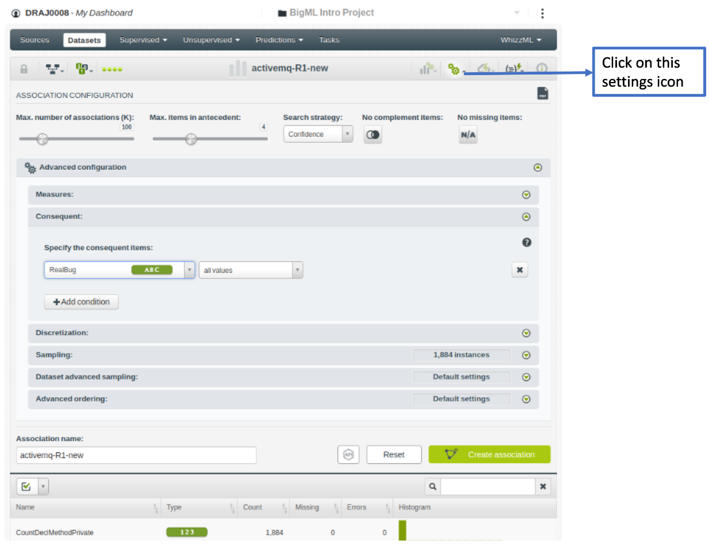
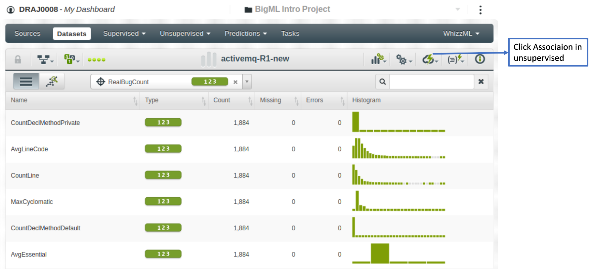
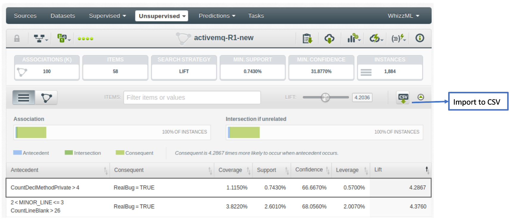

Generating rule-based Explanations
==================================

The execution steps of our framework is explained below.

1.  Build global models
2.  Generate the neighbourhood using instance\_generation function in defect\_class.py
3.  Generate the rules using Association Rule Mining. Here, the generated neighbourhood of a particular instance is considered as the input the association rule miner.
    -   Option 1: The most closest open source package to Magnum Opus is, Opus Miner <https://cran.r-project.org/web/packages/opusminer/index.html>
    -   Option 2: Use BigML <https://bigml.com/dashboard/sources>

**The steps of generating rules using BigML**

Step 1: Click on the dataset with the neighbourhood in the source file 

Step 2: Click on configure dataset 

Step 3: Click on configure dataset. After deselecting unwanted fields, click on “Create Dataset” 

Step 4: Click on Association under un-supervised category to build the model. Set the search category (confidence, coverage, lift and leverage). Specify the consequent as the target column.


Step 5: Click on "Association" under unsupervised category to generate the model 

Step 6: Output rules and import those rules to csv. 

1.  Categorize generated rules to four different types; which provide four types of guidance

This is an R Markdown document. Markdown is a simple formatting syntax for authoring HTML, PDF, and MS Word documents. For more details on using R Markdown see <http://rmarkdown.rstudio.com>.

When you click the **Knit** button a document will be generated that includes both content as well as the output of any embedded R code chunks within the document. You can embed an R code chunk like this:

``` r
summary(cars)
```

    ##      speed           dist       
    ##  Min.   : 4.0   Min.   :  2.00  
    ##  1st Qu.:12.0   1st Qu.: 26.00  
    ##  Median :15.0   Median : 36.00  
    ##  Mean   :15.4   Mean   : 42.98  
    ##  3rd Qu.:19.0   3rd Qu.: 56.00  
    ##  Max.   :25.0   Max.   :120.00

Including Plots
---------------

You can also embed plots, for example:


Note that the `echo = FALSE` parameter was added to the code chunk to prevent printing of the R code that generated the plot.
